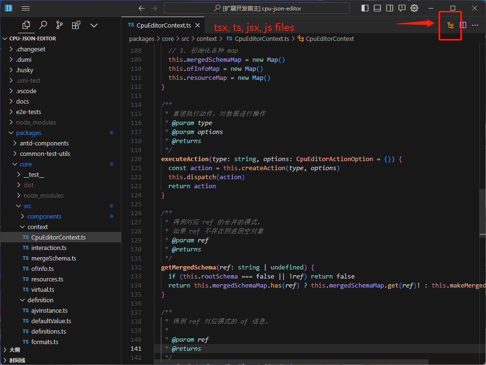
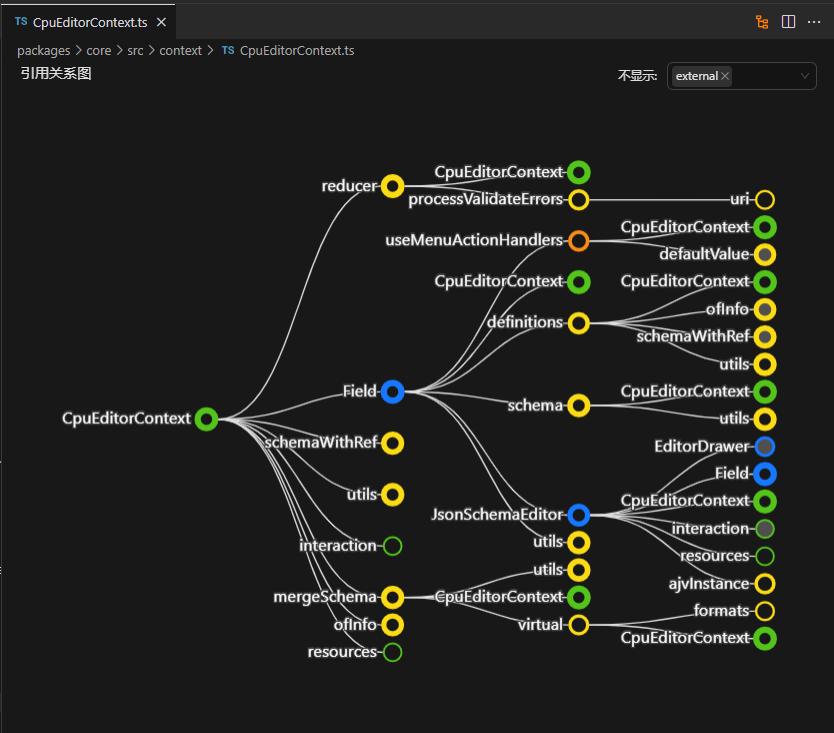

# cpu-ref-graph

working in progress
## Features

Can browse the reference graph of tsx, ts, jsx, js files

- Display file information when hovering a node
- Right click on the node to perform more operations, such as `opening a file`

## Requirements

none

## Extension Settings

none

## Known Issues

none

## Release Notes

### 0.0.1

Initial release

---
